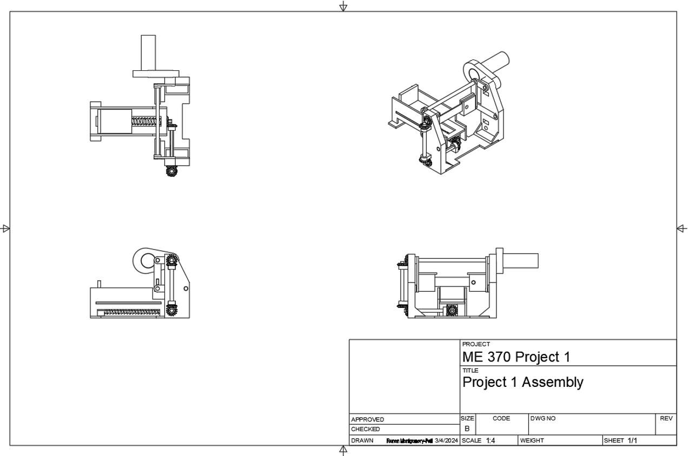
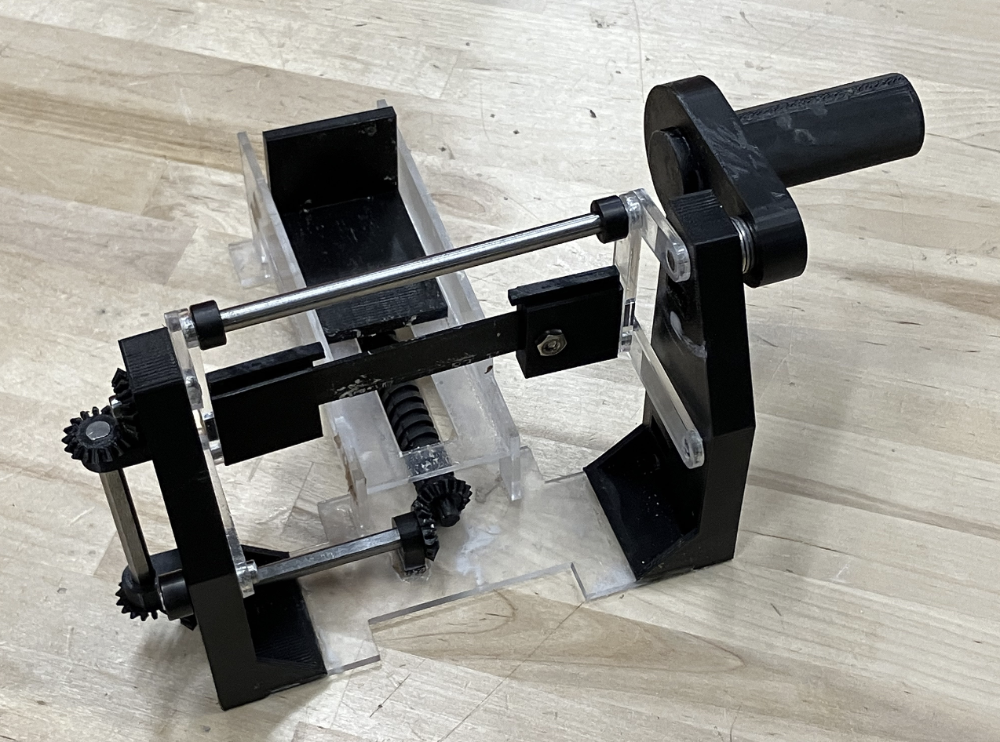

# ⚙️ Automatic Slicing Machine

The goal of this project was to create a human-cenetered solution tailored to individuals with dexterity limitations, such as having reduced arm, wrist hand or finger mobility.

Included are:
- **Detailed Engineering Drawings**
- **CAD design of the final product**
- **A picture of the final product**
- **Design Document**

---

## 🧠 What It Does

This device's cutting mechanism utilizes a four-bar linkage to create the desired motion for cutting. The four-bar linkage works in parallel with a feeder mechanicism that is also controlled from the same starting input movement, but is slightly staggered and slower. This allow for the cutting mechanicism to move faster than the feeder mechanism to allow for ample time to cut efficiently.

---

## 🖼️ Project Gallery

### 🔧 Drawings  

### 📸 Final Project Photo  

